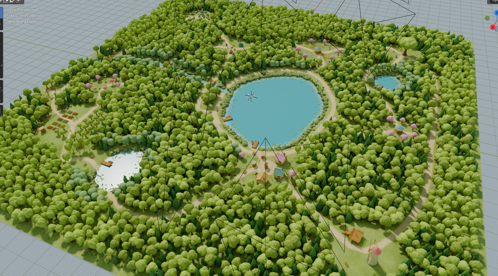
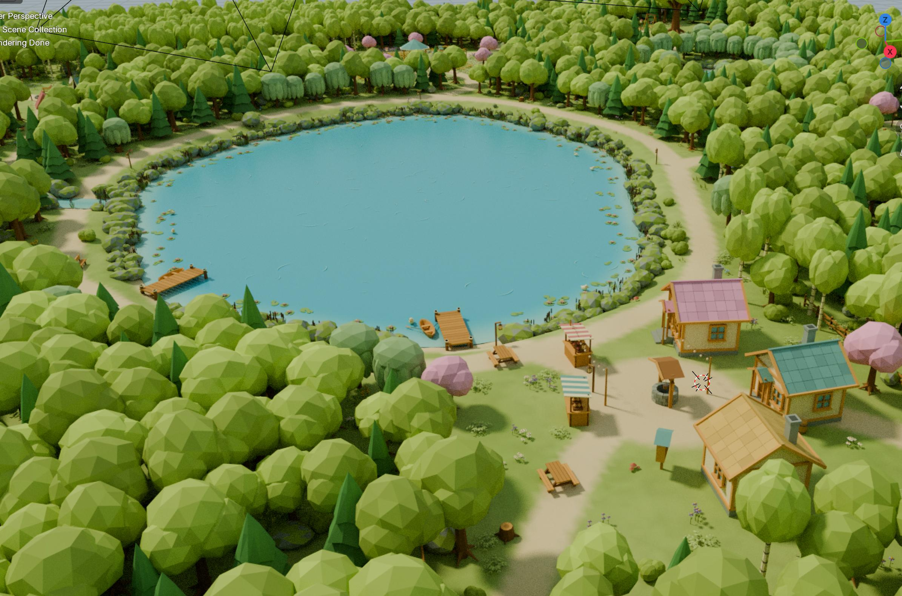
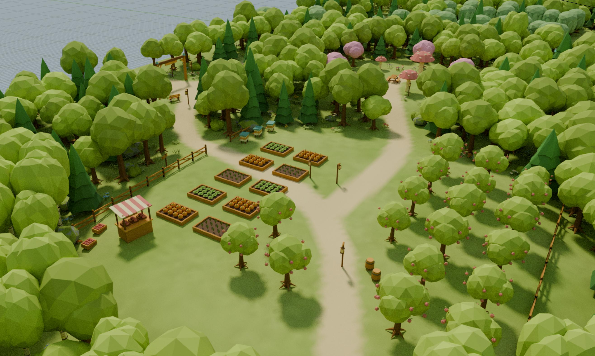

[English](README.md) · [한국어](README_KO.md) · [日本語](README_JA.md)

<p align="center">
  
  
  
</p>

# Cozy Lake Forest — 300 × 300m

참고 이미지의 둥근 로우폴리 수관, 밝은 풀밭, 모래색 산책로, 청록색 물을 기준으로 만든 Blender 씬 생성 스크립트입니다. 기존 64m 씬을 확대하지 않고, 300m 부지에 새로운 동선과 목적지를 배치했습니다.

이 프로젝트는 Codex가 아닌 ChatGPT와의 대화를 통해 생성되었습니다.

**완성 .blend / FBX 파일이 아니라, Blender에서 실행해 모델과 배치를 만드는 소스 패키지입니다.** 전체 폴더를 압축 해제해야 합니다. Blender와 Unreal 실행 검증은 수행하지 못했으며, 순수 Python 생성·기하·배치·좌표 변환을 검증했습니다. 상세 범위는 `TEST_REPORT.md`에 있습니다.

## 1. 바로 시작

1. ZIP 전체를 쓰기 가능한 폴더에 압축 해제합니다.
2. Blender의 **Scripting → Text Editor → Open**에서 `01_build_scene.py`를 엽니다.
3. 텍스트 편집기에 마우스를 두고 **Alt+P / Run Script**를 실행합니다.
4. 생성된 **`CF_CozyLake_300m`** 씬을 확인하고 `.blend`를 직접 저장합니다.

코드의 최소 버전 검사는 Blender 4.2 이상입니다. 특정 Blender/Unreal 버전에서의 정상 작동을 보증하는 뜻은 아닙니다. 외부 Python 패키지 설치는 필요 없도록 작성했으며, Blender 쪽은 내장 `bpy`, `mathutils`, NumPy를 사용합니다.

기존 작업 씬과 이전 64m 패키지의 씬은 별개입니다. 같은 300m 생성기를 다시 실행하면 **이 생성기가 만든 이전 300m 씬을 교체**합니다. 생성 씬에서 수작업한 배치는 재생성 시 사라지므로 먼저 파일을 별도 저장하세요. 사용자 씬에 동일한 씬 이름이 이미 있으면 작업을 중단합니다.

처음에는 무거운 재질 미리보기 대신 **Solid / Vertex Color**로 표시합니다. 렌더와 `.blend` 저장은 자동 실행하지 않습니다. Blender 생성 시간과 메모리 사용량은 실측하지 않았습니다.

## 2. 기본 생성 규모

기본 `cozy_config.json`, seed 42로 실제 생성한 데이터의 수치입니다.

| 항목 | 기본값 / 생성 결과 |
|---|---:|
| 부지 | 300 × 300m, 90,000m² |
| 좌표 범위 | X / Y 각각 -150 ~ +150m |
| 공간 구역 | 50 × 50m, 6 × 6 = 36개 |
| 랜드마크 목적지 | 12곳 |
| 물 지형 | 큰 호수 1개, 작은 연못 2개, 개울 |
| 전체 배치 오브젝트 | 16,573개 |
| 나무 | 3,839그루 — 일반 숲 3,800 + 사과나무 19 + 벚나무 19 + 소원 나무 1 |
| 고유 메시 | 127개 |
| 고유 메시 내역 | 재사용 가능한 나무·소품·건물 원형 77개 + 지형 36조각 + 수면 14조각 |
| 고유 메시 삼각형 합계 | 521,197 |
| 모든 배치를 개별 계산한 삼각형 합계 | 4,807,521 |

마지막 수치는 프레임마다 보이는 삼각형 수나 성능 측정치가 아닙니다. 공유 메시의 인스턴스까지 모두 더한 기하 규모입니다. `default_generation_stats.json`에 모델별·셀별 상세 수량이 있습니다.

지형의 기준 격자는 480 × 480입니다. 산책로·초지·물가는 지형의 버텍스 컬러로 표현하며, 개별 길 메시를 겹쳐 놓지 않습니다. 36개 지형 조각의 경계 정점 높이는 일치합니다. 지형은 Unreal Landscape가 아닌 일반 Static Mesh입니다.

## 3. 산책 목적지

| ID | 장소 | 주요 구성 |
|---|---|---|
| `village` | 호숫가 작은 마을 | 분홍·세이지·꿀색 지붕 오두막, 우물, 작은 장터, 꽃과 벤치 |
| `meadow` | 꽃바람 정원 | 야생화 군락, 정자, 그네, 벌통, 분홍 수관 |
| `camp` | 랜턴 캠핑장 | 3색 텐트, 모닥불, 해먹, 피크닉 테이블, 전구 줄 |
| `orchard` | 꿀벌 과수원 | 사과나무, 텃밭, 벌통, 사과 상자, 농산물 가판 |
| `lookout` | 풍차 전망 언덕 | 언덕 위 풍차, 계단식 목재 데크, 망원경 |
| `guardian` | 소원 나무 숲 | 큰 참나무와 뿌리, 리본 장식, 여우상 |
| `ruins` | 이끼 낀 작은 유적 | 돌 아치, 부서진 기둥, 이끼 바위 |
| `fishing` | 조용한 낚시 연못 | 물가 선착장, 노 젓는 보트, 벤치, 수련 |
| `reading` | 숲속 책 쉼터 | 작은 책장, 정자, 벚나무 |
| `mushroom` | 버섯 티 가든 | 큰 버섯, 피크닉 자리, 작은 꽃과 버섯 |
| `arrival` | 숲 입구 쉼터 | 목조 입구, 이정표, 가벼운 휴식 공간 |
| `boathouse` | 물가 피크닉터 | 테이블, 벤치, 호숫가 산책로 |

외곽 산책길과 호수 순환로를 여러 연결로로 잇습니다. 개울에는 나무다리 3개를 배치했습니다. 수면 주변에는 수련, 부들, 바위, 보트, 앉아 있는 오리가 있습니다. 장소 이름은 공간 디자인 용도이며 낚시·채집·건설·독서 등의 게임 기능은 구현하지 않았습니다.

`previews/00_world_map.jpg`에 셀 번호와 목적지 위치가 표시되어 있습니다. `landmarks.json`에는 위치와 클리어링 반경이 있습니다.

## 4. 메시를 재사용하는 구조

### Blender

`CF_00_ASSET_LIBRARY`는 숨겨진 원형 라이브러리입니다. 배치 오브젝트는 원형과 **같은 Mesh 데이터블록을 참조**하고, 위치·회전·스케일만 다르게 갖습니다. 오브젝트마다 메시를 복사하지 않습니다.

`CF_10_CELLS_50m` 아래에 36개 셀 컬렉션이 있고, 그 안에 나무·꽃·소품 등의 종류별 컬렉션이 있습니다. `CF_20_LANDMARK_MARKERS`에는 숨겨진 목적지 안내 Empty가 있습니다.

배치를 손으로 추가할 때는 **Alt+D**를 사용하세요. 같은 메시를 Edit Mode에서 수정하면 그 모델을 공유하는 모든 배치가 함께 바뀝니다. 한 개만 다른 모델로 만들려면 메시를 독립시킨 뒤 새 메시의 `cf_asset_id`도 고유하게 바꿔야 합니다. 독립 메시 두 개가 같은 ID를 사용하면 내보내기가 중단됩니다.

오브젝트 변환은 양수 스케일을 지원합니다. 음수 스케일, 전단 변형, Shape Key, 적용하지 않은 Modifier, 오브젝트별 재질 오버라이드는 내보내기에서 거부합니다. 내보낼 변형은 공유 원형 메시 자체에 반영하세요.

### Unreal

메시 FBX는 **고유 모델당 한 번** 내보내고, 별도 JSON에 배치 행렬을 기록합니다. Unreal 가져오기는 동일한 Static Mesh 에셋을 재사용합니다.

반복 모델은 기본적으로 **셀 + 모델 ID 단위의 HISM**으로 묶습니다. 같은 나무 모델이 여러 셀에 있어도 Static Mesh 에셋은 하나이며, 셀마다 별도의 HISM 배치 그룹을 가집니다. 해당 셀에서 한 번만 쓰는 모델은 일반 StaticMeshActor로 배치합니다.

**셀 폴더는 관리·선택 가져오기 단위입니다. World Partition, 서브레벨, 런타임 스트리밍을 자동 구성하지는 않습니다.**

## 5. Unreal 내보내기와 가져오기

### 최초 내보내기 — Blender에서

생성 씬 `CF_CozyLake_300m`을 활성화하고 `02_export_unreal.py`를 실행합니다. 필요하면 먼저 `04_validate_blender_scene.py`로 실제 Blender Mesh 데이터블록 공유 상태를 검사합니다.

기본 결과 경로:

```text
output/unreal_export/
  meshes/                   고유 모델별 FBX
  calibration/              축·단위 확인용 FBX 3개
  scene_instances.json      공통 에셋 목록 + 전체 배치 행렬
  geometry_cache.json       변경된 원형 메시를 판단할 해시
  cell_index.json           36개 셀 위치·범위·배치 수량
  cells/C00_00.json          셀별 트랜스폼 목록
  ...
```

Blender 장면의 Unit Scale은 1.0으로 유지하세요. JSON은 Blender 미터 단위의 원본 월드 행렬을 저장합니다. Unreal에서는 실제 가져온 보정용 메시의 위치를 읽어 축 방향과 센티미터 변환을 확인합니다. 보정 메시들은 진단용이며 레벨에 소품으로 배치하지 않습니다.

### 가져오기 — Unreal Editor에서

먼저 작업 레벨을 저장하세요. Unreal에서 **Python Editor Script Plugin**, **Editor Scripting Utilities**를 활성화하고, **Tools → Execute Python Script**에서 이 패키지의 `03_import_unreal.py`를 실행합니다.

기본 콘텐츠 경로는 `/Game/CozyLakeForest300m`입니다. 이전 64m 패키지의 콘텐츠 경로와 분리했습니다. 다른 기기로 옮겼다면 내보낸 전체 폴더를 옮기고 스크립트 상단의 `EXPORT_DIRECTORY_OVERRIDE`를 그 `unreal_export` 폴더로 지정하세요.

HISM 컴포넌트 생성에는 Unreal의 에디터용 SubobjectData API를 사용합니다. 해당 엔진 버전에서 이 경로가 실패하면 다음과 같이 바꿔 일반 액터 경로를 시도할 수 있습니다.

```python
PLACEMENT_MODE = 'ACTORS'
```

이 경우에도 모델 에셋은 공유하지만 배치마다 액터가 생기므로 에디터 관리 비용은 더 커집니다. 실제 엔진에서의 통합 동작은 아직 검증하지 못했습니다.

### 배치만 수정했을 때

`02_export_unreal.py` 상단을 다음과 같이 바꿉니다.

```python
TRANSFORMS_ONLY = True
```

원형 메시가 동일하면 FBX를 다시 쓰지 않고 행렬 JSON을 갱신합니다. **새 모델이 생겼거나 원형 메시가 바뀌면 중단**하므로 그때는 `False`로 돌려 메시도 내보내세요.

Blender에서 메시를 수정해 새 FBX를 내보낸 경우 Unreal 스크립트의 `UPDATE_EXISTING_MESHES = True`로 재가져옵니다. 배치만 바꾼 경우에는 `False`를 유지합니다. Unreal의 임의로 수정한 해당 메시·재질 슬롯은 재가져오기 과정에서 덮어써질 수 있습니다.

### 일부 구역만 다시 배치

Unreal 스크립트 상단에서:

```python
ONLY_CELL_IDS = ['C03_03', 'C04_03']
```

빈 목록 `[]`은 전체입니다. 선택 셀의 이 생성기 소유 액터만 교체하며 다른 셀의 액터는 유지합니다. 오브젝트를 다른 셀로 옮겼다면 **출발 셀과 도착 셀을 함께 갱신**하거나 전체를 갱신해야 이전 배치가 남지 않습니다. 내보내기는 수정 후의 실제 월드 위치로 셀을 다시 판정합니다.

기존 사용자가 만든 레벨 액터는 삭제 대상이 아닙니다. 가져오기 후 레벨 저장은 직접 합니다. 임포트 실패 시 엔진·FBX·에셋 상태는 직접 확인해야 하므로 중요한 프로젝트에서는 복사본 레벨에서 먼저 시험하세요.

## 6. 큰 맵에서 작업하기

`05_focus_region.py`로 일부 셀만 표시할 수 있습니다.

```python
MODE = 'ZONE'
ZONE_ID = 'camp'
```

`MODE = 'ALL'`로 다시 실행하면 전체가 표시됩니다. `MODE = 'CELLS'`와 `CELL_IDS`로 셀 번호를 직접 고를 수도 있습니다. 기본적으로 뷰포트 가시성만 바꾸며, **숨긴 셀도 내보내기에 포함**합니다. 렌더까지 제외하려면 `APPLY_TO_RENDER = True`를 사용하세요.

더 가벼운 생성이 필요하면 `presets/cozy_config_light.json`의 내용을 `cozy_config.json`으로 복사한 뒤 재생성합니다. **300m 부지와 랜드마크 설계는 유지**하면서 기본 숲 목표를 2,400그루, 지형 격자를 240, 주변 작은 장식 수를 4,800으로 줄이는 설정입니다. 꽃·물가 장식도 함께 줄어듭니다.

기본 설정에서 수정하기 쉬운 값은 `seed`, `tree_count`, `ground_detail_count`, `meadow_flower_count`, `terrain_resolution`입니다. 지형 해상도는 셀 수로 나누어떨어지는 값이어야 합니다. 너무 많은 나무를 요구하면 최소 간격 때문에 목표 수에 도달하지 못할 수 있으며 생성 로그에 안내합니다.

## 7. 재질과 게임용 후작업 범위

색상은 `Color` 버텍스 컬러를 사용합니다. 기본 재질은 일반 불투명, 양면 잎, 정적인 스타일라이즈드 수면의 3종입니다. 외부 텍스처 다운로드나 이미지 생성 API를 호출하지 않습니다.

이 패키지에 포함하지 않은 항목:

- 자동 LOD, 게임용 충돌체, 내비게이션, Unreal Landscape·World Partition 설정.
- 움직이는 물·나뭇잎·풍차·모닥불, 실제 발광 랜턴, 상호작용 및 게임 로직.
- 생산용 UV 언랩·라이트맵·텍스처 베이크. `UV0`는 임시 박스 투영입니다.

**Unreal 컴포넌트 충돌은 기본적으로 꺼져 있습니다.** 그대로 플레이하면 지형에서도 캐릭터가 떨어질 수 있으므로 지형·건물·다리에 필요한 콜리전을 먼저 설정하세요. 작은 풀·꽃·수련은 보통 별도 충돌이 필요하지 않지만 프로젝트에 맞게 결정하면 됩니다.

물은 불투명 정적 메시입니다. 모닥불의 불꽃, 전구 줄, 풍차 날개, 소원 리본 등은 정적인 모델 표현이며 애니메이션이나 실제 조명은 아닙니다. 텐트·리본·잎에는 얇은 면 표현이 포함됩니다.

`ENABLE_DETAIL_CULLING`은 Unreal에서 선택적으로 켜는 거리 제거 옵션입니다. 기본은 꺼져 있고, 켜면 작은 소품이 지정 거리에서 사라지며 자연스러운 페이드 셰이더는 제공하지 않습니다.

## 8. 파일 안내와 미리보기

| 파일 | 역할 |
|---|---|
| `01_build_scene.py` | Blender 모델·공유 메시·배치·카메라 생성 |
| `02_export_unreal.py` | 고유 FBX + 전체/셀별 변환 JSON 내보내기 |
| `03_import_unreal.py` | Unreal 에셋 가져오기와 셀별 HISM/액터 배치 |
| `04_validate_blender_scene.py` | 생성된 Blender 씬의 실제 메시 공유 검사 |
| `05_focus_region.py` | Blender 일부 셀/랜드마크만 표시 |
| `cozy_forest_core.py` | 300m 지형·수면·동선·분포 생성 |
| `cozy_mesh_library.py` | 기본 나무·자연물·건물 모델 원형 |
| `cozy_landmarks.py` | 추가 랜드마크와 소품 원형 |
| `cozy_manifest.py`, `cozy_transforms.py` | 셀 그룹 및 좌표 변환 유틸리티 |
| `tests/` | 순수 Python 테스트와 전체 생성 검증 |
| `OPEN_PREVIEWS.html` | 오프라인 미리보기 갤러리 |
| `previews/` | 전체·배치도·주요 랜드마크 이미지 |

미리보기는 **이 스크립트가 생성하는 실제 메시와 트랜스폼**을 별도 CPU 렌더러로 그린 것입니다. 컨셉 이미지가 아니며, Blender 렌더 결과도 아닙니다. Blender/Unreal의 조명·재질·그림자는 다르게 보일 수 있습니다. 참고 이미지 자체나 제3자 모델·텍스처, 폰트 파일은 패키지에 포함하지 않았습니다.
